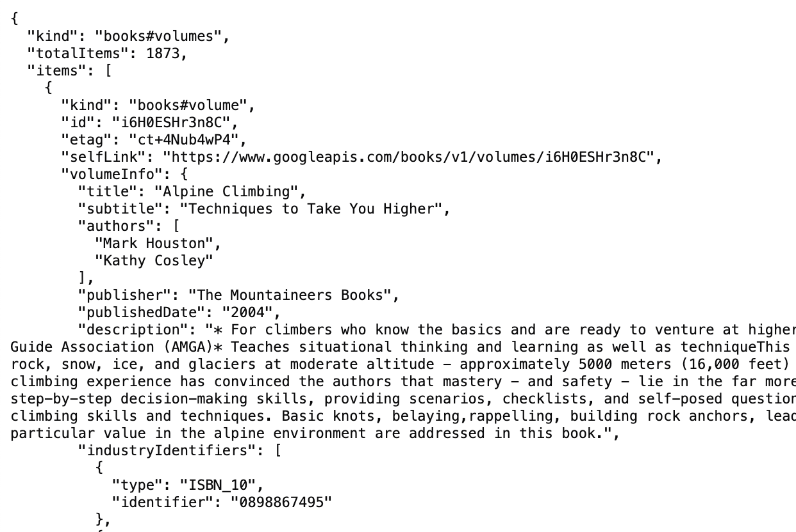
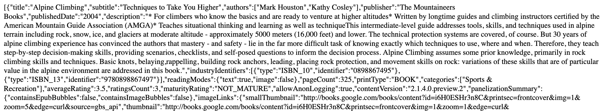
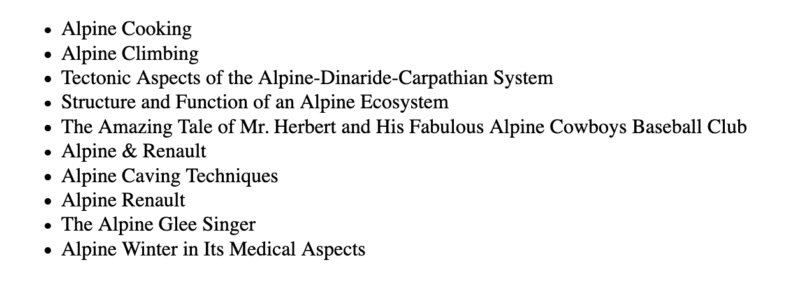

# Tips for real-world AlpineJS

Tackle Alpine FAQs, common issues & web patterns.

---

Hugo Di Francesco ([@hugo__df](https://twitter.com/hugo__df))

Founder Code with Hugo & AlpineJS Weekly

Slides: [codewithhugo.com/alpine-tips](https://codewithhugo.com/alpine-tips)

---

## About

React/Node background I liked how easy it was to get going with Alpine.

Contributed to Alpine: typos, bugfixes, new modifiers, error handling.

Also involved in the community devtools.

---

## Contents

1. What even is `Proxy {}`?
2. Fetch data
3. Send and handle events
4. `x-show` vs `x-if`
5. `x-for` anything

<!-- 6. class vs style binding -->
<!-- 4. Integrate with 3rd party libraries -->

---

## 1. What even is `Proxy {}`?

Demo: https://codepen.io/hugodf/pen/dyvqPbw

----

```html
<div x-data="{ obj: { count: 1 } }">
  <button @click="console.log(obj)">Proxy</button>
</div>
```

On click, console output:

`Proxy { <target>: {}, <handler>: {} }`

----

> [Proxy](https://developer.mozilla.org/en-US/docs/Web/JavaScript/Reference/Global_Objects/Proxy): a JavaScript object which enables you to wrap JS objects and intercept operations on it

This is core to Alpine's reactivity, proxies allow Alpine to detect data updates.

----

### How do I use the data in the Proxy?

Demo: https://codepen.io/hugodf/pen/vYxzEEw

----

```html
<div x-data="{ obj: { count: 1 } }">
  <button @click="obj.count++" x-text="obj.count"></button>
</div>
```

The same as you would use the data if it wasn't in a proxy.

Note: a Proxy and the object it's wrapping are indistinguishable, trust me I tried to do it to make alpine devtools perform better

----

### How do I print the data in the Proxy?

Demos: https://codepen.io/hugodf/pen/yLMxyeo

----

Print it as a string

```html
<button
  @click="console.log(JSON.stringify(obj))"
>
  stringified
</button>
```

Output: `'{"count":1}'` (string)


----

Unfurl the proxy

```html
<button
  @click="console.log(JSON.parse(JSON.stringify(obj)))"
>
  unfurled
</button>
```

Output: `Object { count: 1 }` (JavaScript Object)

Note: "unfurl" fancy way of saying unwrap, we're really doing a deep clone of the data using serialisation/deserialisation -> it's actually another object instance

----

### Debugging tip

```html
  <pre x-text="JSON.stringify(obj, null, 2)"></pre>
```

Don't forget `null, 2` it does the pretty-printing.
<!-- .element: class="fragment" -->

Output:
```json
{
  "count": 1
}
```

Note: `null, 4` for 4-space indented output
---

## 2. Fetch data

How do I load data with Alpine?

Note: you don't

The `fetch` API is a native way to load data in modern browsers from JavaScript.
<!-- .element: class="fragment" -->

----

I want to load & list books that match "Alpine" from Google Books API

----

Let me initialise a `books` array

```html
<div
  x-data="{
    books: []
  }"
>
</div>
```

Note: I know I'm going to want to store some books

<!-- ----

Livecoding: https://codepen.io/hugodf/pen/rNyZOoz -->

----

On component startup (`x-init`), load data from Google Book Search API & extract the response

```html
<div
  x-data="{
    books: []
  }"
  x-init="
    fetch('https://www.googleapis.com/books/v1/volumes?q=Alpine')
      .then(res => res.json())
      .then(res => console.log(res))
  "
>
</div>
```

https://codepen.io/hugodf/pen/mdWGeQo

Note: `fetch` returns a [Promise](https://developer.mozilla.org/en-US/docs/Web/JavaScript/Reference/Global_Objects/Promise) and so does `res.json()`, hence the use of `.then` to access the result of the operation.

----

Output:



Note: JavaScript object with items array of obj that contains volumeInfo

----

Store the `volumeInfo` of each `items` as `books`.

```html
<div
  x-data="{
    books: []
  }"
  x-init="
    fetch('https://www.googleapis.com/books/v1/volumes?q=Alpine')
      .then(res => res.json())
      .then(res => {
        books = res.items.map(item => item.volumeInfo)
      })
  "
>
  <div x-text="JSON.stringify(books)"></div>
</div>
```

https://codepen.io/hugodf/pen/QWpVwXQ

Note: as far as we're concerned, volumeInfo is the book

----

Output:



----

We can clean up the output with `x-for` + `x-text` instead of dumping the data.


```html
  <ul>
    <template x-for="book in books">
      <li x-text="book.title"></li>
    </template>
  </ul>
```

https://codepen.io/hugodf/pen/YzZOKgE

----

Output:



----

### How about a loading state?

----

Pattern:

1. action causes a data load
2. set loading = true & start the data load
3. receive/process the data
4. loading = false, data = newData

----

```html
<div
  x-data="{
    books: [],
    isLoading: false
  }"
  x-init="
    isLoading = true;
    fetch('https://www.googleapis.com/books/v1/volumes?q=Alpine')
      .then(res => res.json())
      .then(res => {
        isLoading = false;
        books = res.items.map(item => item.volumeInfo)
      })
  "
```

Note: we initialised isLoading to false, before fetching set it to true and once we've got the relevant data set it to false again

----

```html
  <div x-show="isLoading">Loading...</div>
  <ul>
    <template x-for="book in books">
      <li x-text="book.title"></li>
    </template>
  </ul>
```

https://codepen.io/hugodf/pen/dyvqPxY

----

Promises/data fetching in JavaScript can easily fill a whole other talk. 

See [codewithhugo.com/async-js](https://codewithhugo.com/async-js) for a deeper look at topics such as fetching in parallel & delaying execution of a Promise.

---

## 3. Send and handle events

One of the other key Alpine features: the ability to send and receive events using `x-on` + `$dispatch`.

----

### Alpine -> Alpine events

`$dispatch('event-name', 'event-data')` 

Creates and sends an "event-name" event with "event-data" as the "detail".

The 2nd parameter ("detail") doesn't need to be a string, it can be an object too. 
<!-- .element: class="fragment" -->

`$dispatch('event-name', { count: 1 })`
<!-- .element: class="fragment" -->

----

Receiving events using `x-on`.

```html
<div
  x-on:peer-message.window="msg = $event.detail"
  x-data="{ msg: '' }"
>
  <div x-text="msg"></div>
</div>
<button
  x-data
  @click="$dispatch('peer-message', 'from-peer')"
>
  Send peer message
</button>
```

https://codepen.io/hugodf/pen/NWpLPXj

----

### When to use `.window`?

When the element dispatching the event is not a child/descendant of the one that should receive it.
<!-- .element: class="fragment" -->

----

### Example of when `.window` is not necessary

```html
<div
  x-on:child-message="msg = $event.detail"
  x-data="{ msg: '' }"
>
  <div x-text="msg"></div>
  <button
    x-data
    @click="$dispatch('child-message', 'from-child')"
  >
    Send message to parent
  </button>
</div>
```

https://codepen.io/hugodf/pen/NWpLPXj

----
The `button` (element that dispatches "child-message") is a descendant/child of the `div` with `x-on:child-message`.

The name for this is ["event bubbling"](https://developer.mozilla.org/en-US/docs/Learn/JavaScript/Building_blocks/Events#bubbling_and_capturing_explained)
<!-- .element: class="fragment" -->

Bubbling: browser goes from the element on which an event was triggered up its ancestors in the DOM triggering the relevant event handler(s).
<!-- .element: class="fragment" -->

If the element with the listener (`x-on`) is not an ancestor of the dispatching element, the event won't bubble up to it.
<!-- .element: class="fragment" -->


Note: bring up event bubbling and why you need to use .window in certain cases. I feel like that gets confusing for people

----

### JavaScript -> Alpine events

----

How is `$dispatch` implemented? ([See the source](https://github.com/alpinejs/alpine/blob/b0a482f63c1a96b3cd44699ecfc0a1fcfcfbec8b/src/component.js#L372-L375))

```js
el.dispatchEvent(new CustomEvent(event, {
  detail,
  bubbles: true,
}))
```
<!-- .element: class="fragment" -->

----

We can do the same in our own JavaScript


```html
<button id="trigger-event">Trigger from JS</button>
<script>
  const btnTrigger = document.querySelector('#trigger-event')
  btnTrigger.addEventListener('click', () => {
    btnTrigger.dispatchEvent(
      new CustomEvent('peer-message', {
        detail: 'from-js-peer',
        bubbles: true
      })
    )
  })
</script>
```
<!-- .element: class="fragment" -->

https://codepen.io/hugodf/pen/NWpLPXj

----


### Alpine -> JavaScript events

We can use `document.addEventListener` and read from the `event.detail` (same as when using `x-on`).

----
```html
<div id="listen">Listen target from JS</div>
<script>
  const listenTarget = document.querySelector('#listen')
  document.addEventListener('peer-message', (event) => {
    listenTarget.innerText = event.detail
  })
</script>
```

https://codepen.io/hugodf/pen/NWpLPXj


----

### Event name x-on quirks

HTML is case-insensitive and `x-on:event-name` is a HTML attribute.

To avoid surprises, use dash-cased or namespaced event names, eg. `hello-world` or `hello:world` instead of `helloWorld`.
<!-- .element: class="fragment" -->


<!-- ---

## 3. Integrate with 3rd party libraries

- Google Maps/Mapbox init, `$refs` + JS
	- create markers from Alpine Data (Alpine -> 3rd party)
	- on market click, update Alpine state (3rd part -> Alpine) -->

---

## 4. `x-show` vs `x-if`

What can you do with `x-show` that you can't with `x-if` and vice versa?
<!-- .element: class="fragment" -->


----

### Concept: short-circuit/guard

Example:

```js
function short(maybeGoodData) {
  if (!maybeGoodData) return [];
  return maybeGoodData.map(...)
}
```

If `maybeGoodData` is `null` we won't get a "Cannot read property 'map' of null" because the `.map` branch doesn't get run.
<!-- .element: class="fragment" -->

The "if" is sometimes called a guard or guard clause & the whole pattern is sometimes called "short-circuiting return", it avoids running code that could cause errors. 
<!-- .element: class="fragment" -->

----

`x-if` doesn't evaluate anything inside the template if `x-if` evaluates to `false`.

Same as the guard in our `short` function it helps us skip evaluations that could be dangerous.
<!-- .element: class="fragment" -->

`x-show` keeps evaluating everything (x-show only toggles `display: none`).
<!-- .element: class="fragment" -->

----

```html
<div x-data="{ obj: null }">
  <template x-if="obj">
    <div x-text="obj.value"></div>
  </template>
  <span x-text="'not crashin'">crashed</span>
</div>

<div x-data="{ obj: null }">
  <div x-show="obj">
    <div x-text="obj.value"></div>
  </div>
  <span x-text="'not crashin'">crashed</span>
</div>
```

[https://codepen.io/hugodf/pen/vYxzOze](https://codepen.io/hugodf/pen/vYxzOze?editors=1000)

`x-if` doesn't crash

`x-show` does due to `obj.value`

----

### Performance

Depending on what you're doing you might find that `x-show` or `x-if` yields better performance.

`x-show` toggles a single `style` property.

`x-if` inserts/removes DOM Nodes.

If you're having performance issues with one, try the other.
<!-- .element: class="fragment" -->

Note: Kevin in devtools perf issue https://github.com/alpine-collective/alpinejs-devtools/pull/182/files

---

## 5. `x-for` anything

- objects
- range
- `key`

---


## Useful links

- "slides": [codewithhugo.com/alpine-tips](https://codewithhugo.com/alpine-tips)
- all the demos: [codepen.io/collection/ZMMNgj](https://codepen.io/collection/ZMMNgj)
- Async JS: [codewithhugo.com/async-js](https://codewithhugo.com/async-js)
